This is a little writeup of a project I did in collaboration with a classmate while studying a algorithmic complexity class. We implemented a faster, but still exact, \\(k\\) nearest neighbors classifier based on k-d trees. I learned a lot and hope this can be interesting to some of you.

<!--more-->

# 1 Introduction

## 1.1 What is classification?

The problem we are trying to resolve is the following :

- We have \\(n\\) points in a \\(d\\)-dimensional Euclidean space
- each of these points is one of two colors : _Blue_ or _Red_
- Some of the points have no assigned colors

The goal of this exercise is to accurately guess the color of the points for which we don’t know it. This is a very common problem in machine learning.

## 1.2 A simple example

We will use this simple dataset in a 2 dimensional space, where each data point is represented by 2 coordinates _(the \\(X\\) vector)_ and has a color _(the \\(Y\\) vector)_:


$$
\begin{aligned} X &= \{(1,3),(1,8),(2,2),(2,10),(3,6),(4,1),(5,4),(6,8),(7,4),(7,7),(8,2),(8,5),(9,9)\}\cr
Y &= \{Blue, Blue, Blue, Blue, Blue, Blue, Red, Red, Red, Red, Red, Red, Red\} \end{aligned}
$$


We are given the following point: \\((4,8)\\) and we want to determine its color.

# 2 What is used today?

## 2.1 A lot of different classification methods

There are hundreds of different methods to be able to classify these points into labels. ranging from simple : like \\(k\\)-NN or logistic regression to more complicated with methods like recurring neural networks, kernel methods, random forests, etc...  
In our case, we are placed in a euclidean space of \\(d\\) dimensions, so we will only be dealing with real coordinates _(ie. purely numerical values)_ so we can implement simple numerical methods. We have chosen to implement the \\(k\\) nearest neighbor method to classify our unknown points. One of the reasons we chose this algorithm is that the naive approach is very straightforward but there is a lot of potential to improve the runtime and make it perform better in different use-cases (like high dimensionality)

## 2.2 KNN

The principle behind the \\(k\\) nearest neighbors _(k-NN)_ method is very simple :  
we try to find the \\(k\\) nearest points to the one we are trying to classify according to some distance function.

### 2.2.1 Finding the nearest neighbor

The naive approach is very simple to implement, we choose a distance function, calculate the distance of the point we want to classify to all the points in the training set and we return the point for which that distance is minimal.  
The distance used in this nearest neighbor search can be any of a number of functions (\\(x\\) being our known point, \\(q\\) the point we want to classify and \\(d\\) the number of dimensions) :

- **Euclidean distance**: \\(\quad d(x,q) = \sqrt{\Sigma_{i=1}^d(x_i-q_i)^2}\\)
- **Manhattan distance**: \\(\quad d(x,q) = \Sigma_{i=1}^d\vert x_i-q_i\vert\\)
- **Chebychev distance**: \\(\quad d(x,q) = \underset{i}{max}(\vert x_i - q_i\vert)\\)

In a lot of cases the Euclidean distance is used, so in our implementation we will use it as well.

### 2.2.2 Transposing to \\(k\\) nearest neighbors

To select the \\(k\\) nearest neighbors we can simply run the nearest neighbor algorithm while keeping a priority queue of points sorted according to their distance and keep the \\(k\\) points with the lowest distances. This can also be achieved by keeping the points in a list along with their distance (rather than a priority queue) and sort the list according to distances after calculating all distances.

Once we have the \\(k\\) nearest neighbors to assign a label to our unclassified point it is a simple majority vote situation where the label that is the most present in the \\(k\\) nearest neighbors is assigned to the point.  
We must of course take in to account the value of \\(k\\) if \\(k= 1\\) then we are in the nearest neighbor problem, if \\(k\\) is big then what happens to size complexity, what happens if there is a tie in our \\(k\\) nearest neighbors labels?

### 2.2.3 How can we lower the number of calculations?

In the naive approach we calculate the distance of the unknown point to all the other points of the dataset. This is of course very costly computation-wise it would be best to eliminate some possibilities.

## 2.3 Exact KNN versus approximate KNN

There already exist faster versions of the \\(k\\)-NN algorithm that identify regions in our search space, within which to compute distances so we don't compute distances for every point in the dataset, some of these being <a></a>[LSH](https://www.youtube.com/watch?v=LqcwaW2YE_c) _(Locality Sensitive Hashing)_ and an approximate version of <a></a>[k-d trees](https://www.youtube.com/watch?v=Y4ZgLlDfKDg) _(Both of the links are videos by Victor Lavrenko who was a great ressource for us, so thanks Victor!)_. However most of these sped-up methods are based on heuristics or approximations, meaning we can't be sure that the actual nearest neighbors are in the searched sub-space. What we wanted to do is still keep an exact method for \\(k\\)-NN.

# 3 What did we implement?

Of we course, as we wanted to be as efficient as possible, we did not implement a naive version of the \\(k\\)-NN method. We used \\(k\\)-dimensional trees _(ie. k-d trees)_ to help us prune the search space and be able to be more efficient with our computing. k-d trees allow us to partition the \\(k\\)-dimensional Euclidean space into subspaces and organize our known points into a data structure similar to binary-search trees.

## 3.1 k-d trees

To be show how this structure is created we will use a simple 2-dimensional example, it is simpler to represent and visualize but higher dimensional k-d trees work in the exact same way.  
The dataset we have is the same as the one in our first example, where each point has \\(x_1\\) and \\(x_2\\) dimensions.


$$
X=\{(1,3),(1,8),(2,2),(2,10),(3,6),(4,1),(5,4),(6,8),(7,4),(7,7),(8,2),(8,5),(9,9)\}
$$


To construct the tree, we will alternatively split on the median of the first dimension and then the second at each level. So on level on we will split on the median of dimension 1, on the second level we will split on the median of the second dimension, on the third level we will split on the first dimension again and so on and so forth until all our points are placed in the tree. Since we always split on the median according to the selected dimension, we can assure that the tree will be as balanced as it can be, which will speed up any subsequent searching operations in that tree.  
So if we implement this method to our dataset we will have :

1. the median on the first dimension is \\(5\\), so the \\((5,4)\\) point will be our first node of the tree. On the left subtree we will have all the points for which \\(x_1 < 5\\) and on the right subtree all the points for which \\(x_1 \geq 5\\).
2. We now place ourselves in the left subtree of \\((5,4)\\). We will now split the sub-space according to the second dimension. The median point according to the second dimension is now \\((3,6)\\) so in the left subtree of \\((3,6)\\) will be all the points of the sub-space for which \\(x_2 < 6\\) and on the right subtree all the points for which \\(x_2 \geq 6\\).
3. We build the tree in a recursive manner building the left subtree first and then the right subtree.

In the end we end up with the following k-d tree :

<a name="kdtree"></a>
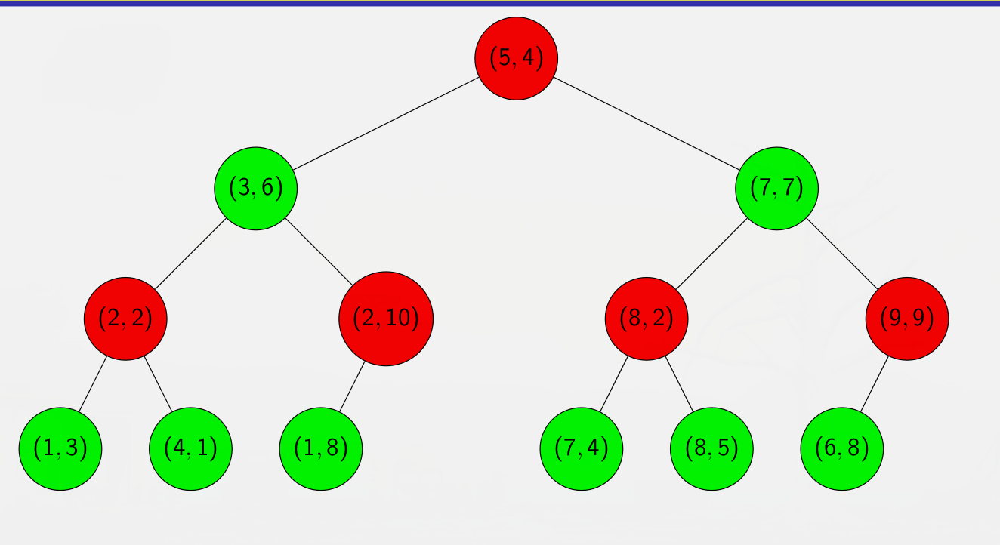

The red nodes are splitting on the first dimension, and the green nodes on the second.  
It is also easy to see how this can be generalized to higher dimensions, the process is identical except that instead of looping on 2 dimensions, we loop on \\(d\\) dimensions. For instance if we have 3 dimensions, the first 3 levels are split on their corresponding dimensions and then the subsequent levels of the tree are split according to the remainder of the euclidean division \\(\frac{level}{d}\\) , so for example the 4\\(^{th}\\) level of the tree will be split along the 1\\(^{st}\\) dimension.

To build the tree we need to define a `Node` object first that will be the main component of our tree:

```python
class Node:

   def __init__(self, value, parent:Node, axis:int, visited:bool):
      self.value = value
      self.parent = parent
      self.axis = axis
      self.visited = visited
```

Then we can execute the recursive tree building function:

```python
# for first iteration: depth=0 and parent=null
def create_tree(points::list, dimensions::int, depth::int, parent::Node)

   # stop condition of recursive function
   if len(points) == 0:
      return

   # sort along selected axis
   axis = depth % dimensions 
   points.sort(along=axis)

   # select root
   median = len(points) / 2
   root = new Node(points[median], parent, axis, false)

   # build right and left sub trees
   root.left = create_tree(points[0 : median], dimensions, depth+1, root)
   root.right = create_tree(points[median : len(points)], dimensions, depth+1, root)
```

The node object having a value element (the coordinates of the point), a left subtree, a right subtree
and the axis bring the dimension along which it was split. The node object also has a visited boolean
attribute that will be useful for search functions later on.

It is also interesting to note that on line 6 of the algorithm, the points list is sorted, depending on
the sorting method the time complexity will not be the same. We use either `shellsort` or `quicksort` in our
implementation.

## 3.2 k nearest neighbor search

Now that we have our <a></a>[data organized as a k-d tree](#kdtree), we must use this data-structure to our advantage as
we search for the k nearest neighbors. The search begins with a tree traversal similar to the one we would
do if we wanted to insert the point we want to classify. So if we take our example of a 2−\\(d\\) space and
we want to find the nearest neighbor of the point \\((4,8)\\). To calculate distances we will use the Euclidean
distance.

1. We compare it to the first point in our tree. \\(d((4,8),(5,4)) = \sqrt{(4\text{ - }5)^2 + (8\text{ - }4)^2} = 4.12\\) which
   becomes our minimum distance. since the first level cuts on the first dimension we compare : \\(4 < 5\\)
   so we search in the left subtree first.
2. We now calculate \\(d((4,8),(3,6)) = 2. 24\\) which is now our closest distance.we now compare the
   second dimensions. \\(8 \geq 6\\) so we now search the right subtree.
3. \\(d((4,8),(2,10)) = 2. 83 > 2.24\\) so we do not update the closest distance and \\((3,6)\\) is still our current
   nearest neighbor. We explore the right subtree and it is empty.

At first glance we could think that this is it, we return \\((3,6)\\) as our closest neighbor and the search ends. However that is not the case, indeed the closest neighbor is \\((6,8)\\) as \\(d((4,8),(6,8)) = 2\\). So how do we get to that point? Well for that we would go back up the tree and search unvisited subtrees. so we would go back up to \\((2,10)\\) explore it’s left subtree, then go back up to \\((3,6)\\) and explore it’s left subtree until we went back to the root node and explored it. We can notice however that \\((6,8)\\) is quite far away in the tree and would be among the last point to be explored. And even if it was amongst the first points to be explored we could not be sure that it was the closest point unless we had calculated all the distances before hand if we stick with tree traversal alone. Therefore we need a pruning rule that allows us to eliminate subtrees that we are sure cannot contain a nearer point than the current closest neighbor we know about.

This pruning rule can be easily visualized if we build bounding boxes each time we split points in our space.

we start of with our points in our 2−\\(d\\) space:  
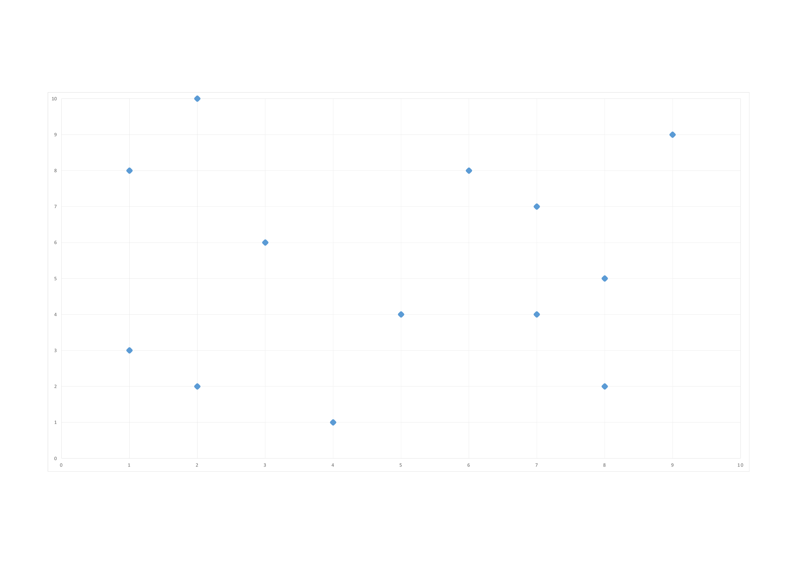

We do our first split at \\((5,4)\\) along the \\(1^{st}\\) dimension _(x)_:  
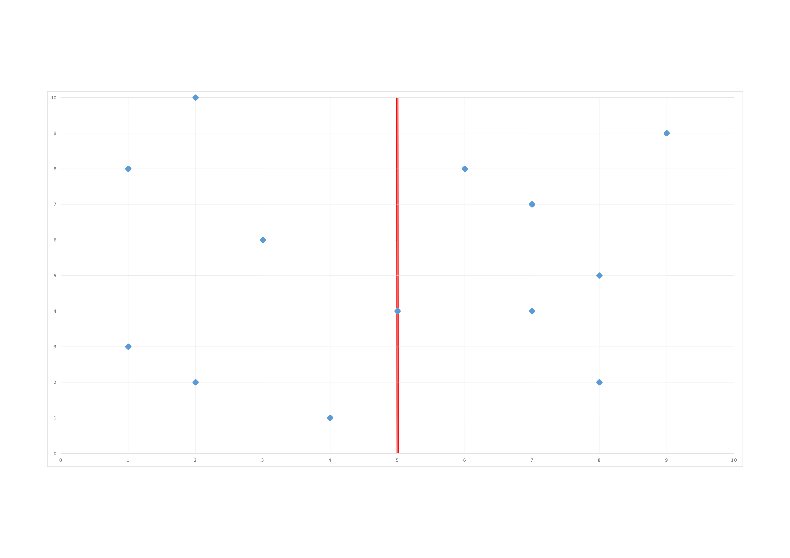

We do our second split along the \\(2^{nd}\\) dimension _(y)_:  
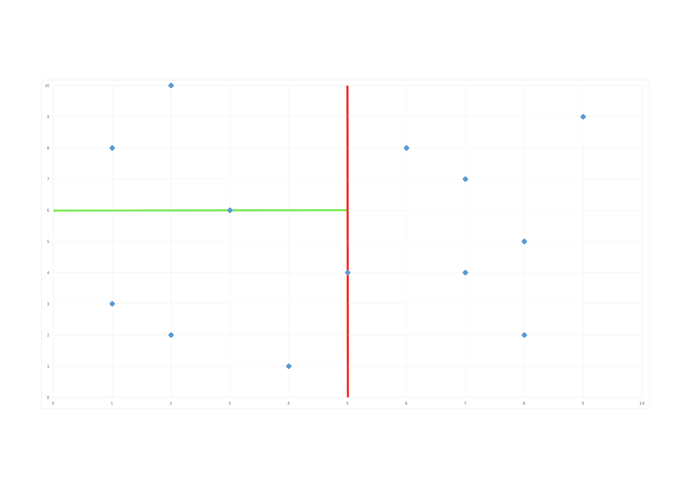

Our space is divided in these bounding boxes at the end of the construction of our tree:  
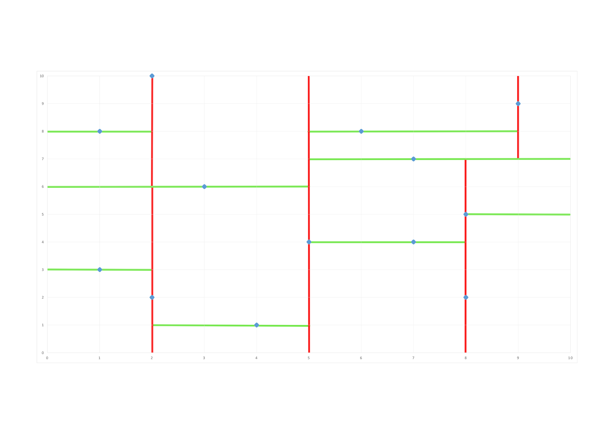

The rule to prune our tree is to compare the closest distance we know to the closest distance possible between the point we want to classify and the bounding box we want to prune. This closest possible distance is a straight line in this 2−\\(d\\) space. So depending on the dimension along which the bounding box is defined we compare the closest distance we know about and the distance along the considered dimension between the point and the bounding box, if this dimension-wise distance is greater than the current nearest distance a nearer neighbor cannot possibly be contained in that bounding box, therefore we can prune the corresponding subtree and save some computing time.

To better understand how the pruning process works let’s apply it step by step in our example :

1. our first distance \\(d((4,8),(5,4)) = 4.12\\) is greater than \\(\vert 5 \text{ - } 4 \vert = 1\\) so we cannot prune the right subtree of \\((5,4)\\) and that is good because our real closest neighbor is in this right subtree.
2. as in our first search detailed above we then calculate \\(d((4,8),(3,6)) = 2.24\\) , we calculate the closest distance to the bounding box: \\(\vert 8 \text{ - } 6 \vert= 2 < 2.24\\) so we cannot prune the left subtree.
3. the search goes along exactly like the first one until we reach \\((1,3)\\) our closest distance for the moment is still \\(2.24\\) however \\(\vert 8 \text{ - } 3 \vert = 5 > 2\\) so we can eliminate the search of any of \\((1,3)\\)’s subtrees.
4. after \\((1,3)\\) we have explored the entirety of the root’s left subtree and we arrive in \\((7,7)\\) the distance is greater than 2. 24 so it not our new closest neighbor. We will explore the right subtree first because \\(8 \geq 7\\). we cannot prune the left subtree because \\(\vert 8 \text{ - } 7 \vert = 1 < 2.24\\)
5. we explore \\((9,9)\\) explore it’s subtrees and find our new nearest neighbor \\((6,8)\\) so now the closest distance is \\(2\\).
6. we explore the left subtree of \\((7,7)\\), and arrive at \\((8,2)\\) we will be able to prune the right subtree of \\((8,2)\\) and will have to explore the left.

In the end we will have pruned 2 subtrees which is not a lot, but that is because we are working with a small dataset, in larger spaces the pruning becomes a lot more important.

Now we can note that we have applied this technique for the search of only one nearest neighbor,
however it is very easy to transpose that principle to a \\(k\\) nearest neighbor search. Indeed we just have to save the \\(k\\) best distances and their associated points in a length \\(k\\) priority queue. If the queue is not full we add any point we explore to it, once it is full if we find a point with a closer distance than the last point of the queue we insert the new point in the queue and remove the last point of the queue (since it is prioritized according to distance, the last point of the queue will always be the furthest one from the point we want to classify).

The pruning works in the exact same way except that instead of comparing the dimension-wise distance to the closest distance, we compare it to the biggest distance in our queue so that we know that the bounding box we are pruning cannot possibly contain a closer point than what we have already explored and found. Note that to be able to prune our priority queue must be full.

Therefore the algorithm to find the \\(k\\)-nearest neighbors becomes the following :

```python
def nearest_neighbors(query:point, node:Node, candidates:queue, dist_min:float, k:int):

   # stopping condition of recursive function
   if node == None or node.visited:
      return

   dist = distance(query, node)

   if dist <= dist_min:
      candidates.append(tuple(query, dist))
      candidates.sort() # according to distance

      if len(candidates) > k:
         candidates.pop() # remove last element
      
      dist_min = candidates[-1].distance # biggest of the minimum distances

   # explore left subtree
   if point[node.dimension] < node.value[node.dimension]:
      nearest_neighbors(query, node.left, candidates, dist_min, k)

      # there might be neighbors in the right subtree
      if abs(point[node.dimension] - node.value[node.dimension]) <= dist_min:
         nearest_neighbors(query, node.right, candidates, dist_min, k)
      else:
         node.right.visited = True # pruning right subtree
   
   # explore right subtree
   else:
      nearest_neighbors(query, node.right, candidates, dist_min, k)
      
      # there might be neighbors in the left subtree
      if abs(point[node.dimension] - node.value[node.dimension]) <= dist_min:
         nearest_neighbors(query, node.left, candidates, dist_min, k)
      else:
         node.left.visited = True # pruning left subtree
   
   node.visited = True

```

`query` is the data point for which we want to find neighbors, `node` is the considered node of the \\(k-d\\) tree (so during the initial execution of `nearest_neighbors` `node = root`). `candidates` is the priority queue where both the \\(k\\) best nodes of our tree and their distances to `query` are stored. `dist_min` is the biggest distance in `candidates` _(so the biggest of the \\(k\\) minimum distances)_  
We do not have to return `candidates` because it is modified directly by the function. we can then see the \\(k\\) nearest neighbors in the final candidate list. To assign a label to the point we simply look at the labels of all the points in the list `candidates`.

If we continue our example, to classify multiple points we simply build the kd-tree with the labeled data, and apply the `nearest_neighbors` function to each unlabeled point. However the question of the choice of \\(k\\) is important. Without any prior knowledge of the data it is difficult to say how many neighbors we need to be able to classify our unlabeled points correctly. to visualize this let’s continue our example. We want to determine the label of the \\((4,8)\\) point. We know that the for a \\(k\\) of 3 we have these closest nodes :


$$
\begin{aligned} nearestNeighbors &= \{(6,8),(3,6),(2,10)\} \\
   distances &= \{ 2 , 2.24 , 2.83 \} \end{aligned}
$$


If we do a simple nearest neighbor search, the label assigned to \\((4,8)\\) will be the same as \\((6,8)\\), so the point will be labeled as \\(Red\\), however if we choose \\(k= 2\\) there is one \\(Blue\\) point and one\\(Red\\) point in the list, so \\((4,8)\\) will be labeled on or the other with a \\(50\%\\) chance each. If we choose \\(k= 3\\) however there are \\(2\\) \\(Blue\\) points and on \\(Red\\) point so \\((4,8)\\) will be labeled as \\(Blue\\). With this simple example it is easy to see the impact of the choice of \\(k\\) on classification of unlabeled points. This is where cross-validation can help.

## 3.3 cross-validation

In our program we have the possibility to implement \\(l\\)-fold cross-validation(it is usually called \\(k\\)-fold cross validation but to avoid confusion with the \\(k\\) from \\(k\\)-NN we call it \\(l\\)-fold CV), to be able to choose the best \\(k\\). \\(l\\)-fold cross validation works in a very simple way. it is fed a labeled dataset which it splits into a training set and a testing set according to a test proportion parameter. The training set is then divided into \\(l\\) folds, which is to say that is divided into \\(l\\), non-overlapping, inner testing sets (and therefore also \\(l\\) inner training sets which can overlap). We also feed the cross validation function a set of various \\(k\\) values we would like to test \\(k\\)-nearest neighbors for. for each \\(k\\) in the set the cross-validation function will execute the `nearest_neighbors` function on each inner training set for the points of the corresponding inner testing set and calculate the classification error on the considered fold (ie. considered inner testing and training sets), once we have the classification errors for each of the folds for a value of \\(k\\), we average these errors and the result of that operation will be the performance of our \\(k\\). We repeat this for all the values of \\(k\\) in the set of \\(k\\)s we want to try and the one with the lowest average error rate will be considered the best value of \\(k\\) and be the one used to classify the points that we want to label.

## 3.4 best case complexity

Given all that we have defined we can calculate the best case time complexity of our program.

### 3.4.1 k-d tree creation

We will calculate this complexity based on the assumption that our sorting algorithm that sorts the points list to find the median is quicksort which has best case complexity of \\(nlog(n)\\) (This is also it’s average time complexity which is why we chose this sorting algorithm). At each call of the function the points list is sorted then divided in two and the function s called recursively on each of these two half lists.  
Therefore computing time \\(T_{create}(n)\\) can be calculated, since the function is recursive it is equal to the complexity of `quicksort` plus twice the itself but for half the dataset:


$$
T_{create}(n) = nlog(n) + 2T(\frac{n}{2})
$$


This continues, since we can express \\(T(\frac{n}{2})\\) in terms of \\(T(\frac{n}{4})\\):


$$
\begin{align}
   T_{create}(n) &= nlog(n) + 2(\frac{n}{2}log(\frac{n}{2}) + 2T(\frac{n}{4}))\\\\
   T_{create}(n) &= nlog(n) + nlog(\frac{n}{2}) + 4T(\frac{n}{4})\\\\
   T_{create}(n) &= nlog(n) + nlog(\frac{n}{2}) + nlog(\frac{n}{4}) + \cdots + nlog(\frac{n}{2^{log(n)}})
\end{align}
$$


Why \\(2^{log(n)}\\)? well it's because each new call to `create_tree` on half the dataset corresponds to moving one level down the tree, and there are roughly \\(log(n)\\) levels for a \\(k\\)-d tree of \\(n\\) points.  
From here it is easy to see the commonality between each term of the sum and we can express them in a nicer way:


$$
T_{create}(n) = n\sum^{log(n)}_{i=0} log(\frac{n}{2^i})
$$


We can now go to "big O" notation:


$$
\begin{align}
   T_{create}(n) &= o\bigg( n\sum^{log(n)}_{i=0} log(n) \bigg)\\
   T_{create}(n) &= o(nlog^2(n))
\end{align}
$$


### 3.4.2 Total complexity of algorithm

The nearest neighbor search, in the best case is akin to an insertion. Indeed in the best possible case for nearest neighbor search we are able to prune all the subtrees that we don’t visit immediately and so we are able to find the nearest neighbors after traversing the levels so \\(T_{search}(n) =o(log(n))\\)  
To find the \\(k\\) nearest neighbors of a set of \\(p\\) unlabeled points, we have to create the \\(k\\)-d tree once and then do \\(p\\) nearest neighbor searches. Therefore the best case time complexity in this case would be :


$$
\begin{align}
   T_{total}(n) &= T_{create}(n) + pT_{search}(n)\\
   T_{total}(n) &= o(nlog^2(n) + plog(n))
\end{align}
$$


so if \\(p > nlog(n)\\) then \\(T_{total}(n) =o(plog(n))\\) otherwise \\(T_{total}(n) =o(nlog^2 (n))\\).

The \\(l\\) fold CV search does not increase time complexity unless the set of \\(k\\)s to test and/or the number of folds is very high.

## 3.5 worst case complexity

The worst case complexity of `quicksort` is \\(o(n^2)\\) which is very bad, however it appears only if the array to sort is already sorted which we have no reason to be the case in our situation, indeed since we sort along one dimension at a time sorting along one axis could shuffle along other dimensions, so it is quite unlikely that the sorting algorithm would sort already sorted point lists. Nonetheless it is still interesting to calculate worst case complexity :


$$
\begin{align}
   T_{create}  &= n^2 + 2T_{create}(\frac{n}{2})\\
   T_{create}  &= n^2 + 2 \big((\frac{n}{2})^2 + 2T_{create}(\frac{n}{4})\big)\\
   T_{create}  &= \sum^{log(n)}_{i=0} \frac{n^2}{2^i}\\
   T_{create}  &= n^3(2 - 2^{-log(n)})\\
   T_{create}  &= o(n^3)
\end{align}
$$


So in the worst case the \\(k\\)-d tree could take a very long time to build. For our nearest neighbor search, the worst case is if we do not prune anything, and therefore the search becomes akin to a depth first search in a binary tree which is \\(o(n)\\), however once again that is very unlikely to happen because that is the case if the binary tree is unbalanced but due to the way we create it (splitting the points into two equally sized subtrees) it is, by construction, balanced. In this case the worst case complexity to classify \\(p\\) unlabeled points becomes \\(o(n^3 + pn)\\) so if \\(p > n^2\\) then \\(T_{total}(n) =o(pn)\\) otherwise \\(T_{total}(n) =o(n^3)\\). This is not a good complexity, however due to the extreme unlikelihood of us being in that case, we felt that it was an acceptable risk.

The case where \\(k\\)-d trees really can be useful is in the case of high dimensional data, because building the \\(k\\)-d tree does not depend on the dimensionality of the space the points are in, that part of the runtime is unaffected by the size of the space. However in high dimensional spaces distance computing becomes a lot more costly, and the pruning that allows us to compute a lot less distances give a significant advantage over a naive approach, whereas in low dimensional space the naive approach might be faster, as it’s runtime would be in \\(o(n)\\) for a single \\(k\\)-NN search.

## 3.6 results

Our method performs fairly well. A timing wrapper function has been implemented to be able to measure the runtime of our. We timed our `batch_knn` function that builds a \\(k\\)-d tree on the dataset and then finds the `k` nearest neighbors for a list of unlabeled points. we measured the runtime of our function as a function of \\(n\\) the number of points in the training set, which was generated so we could control the size and dimensionality easily.

runtime depending on \\(k\\):  
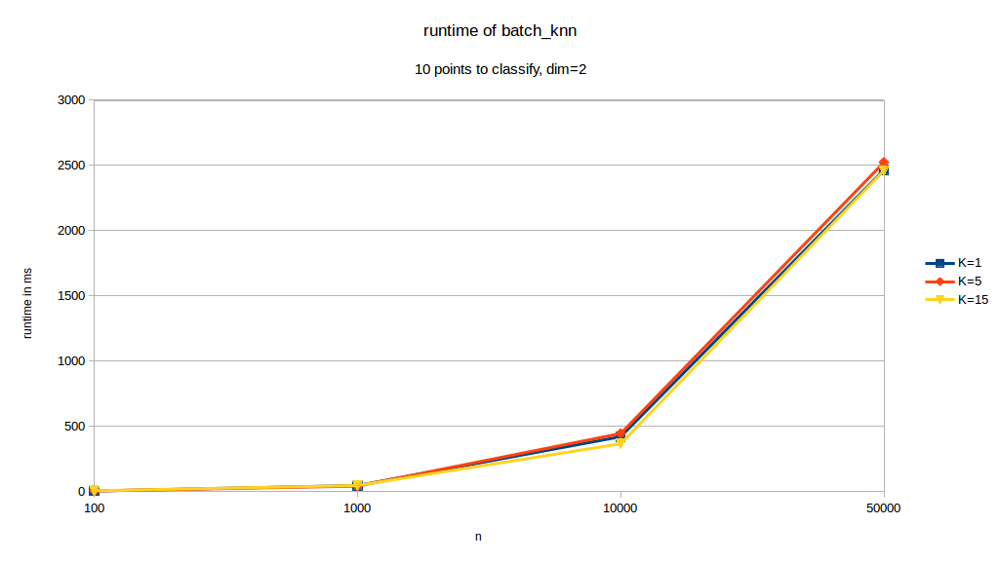

runtime depending on \\(p\\) the number of points to classify:  
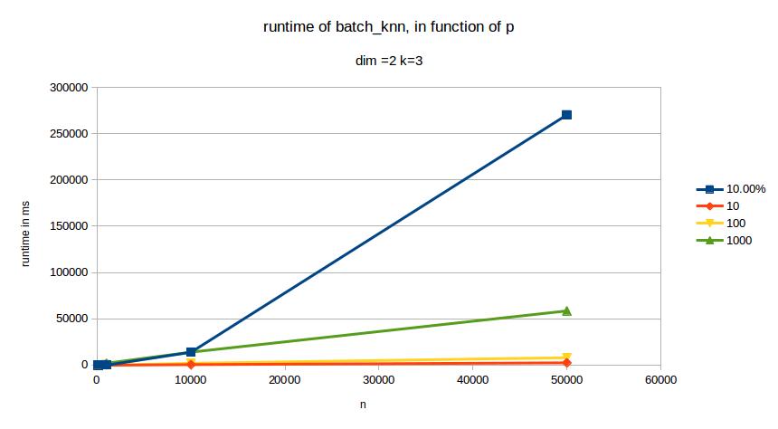

runtime depending on \\(d\\) the dimension of the dataset:  
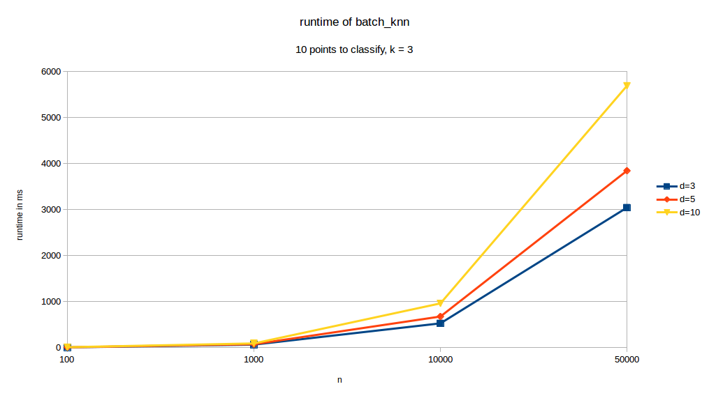

As we can see, changes in \\(k\\) have almost no effect of the runtime of our function. When changing dimensions however we can see that \\(d\\) has a significant impact on runtime. \\(p\\) also has a very pronounced effect on runtime. The curve with the \\(10\%\\) legend is the case where \\(p= 0.1\cdot n\\).

As to the accuracy of our classifications we tested our method on the <a></a>[Iris dataset](https://en.wikipedia.org/wiki/Iris_flower_data_set) for which we only selected two classes (out of the three).When we select the \\(setosa\\) and \\(versicolor\\) varieties, since they are very distinct groups, \\(k\\)-NN is very accurate :

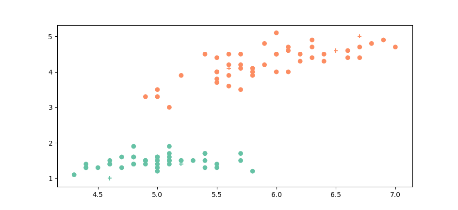

The round points are our known points, the crosses are the points we classified. The class of the known point or the class we assign to unknown points is represented by the color. As we can see it is very easy to assign a label to our unknown points. And indeed our accuracy on this set is of100%.  
When we compare \\(versicolor\\) and \\(virginica\\), however the groups are no longer so easily separable :

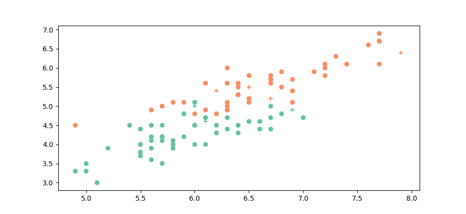

In this case it can be interesting to do cross validation to figure out the best \\(k\\). We did it on this dataset (\\(virginica\\) and \\(versicolor\\)) and got the following results:

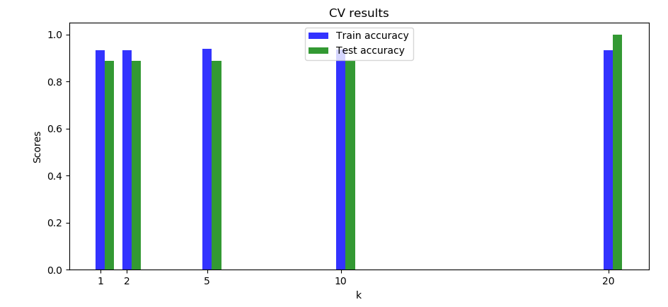

We can see the accuracies are fairly similar we can that the highest testing accuracy is for \\(k= 20\\).

We also tried our implementation on the full Iris dataset:  


The cross validation results are similar to the one with only the 2 species:  
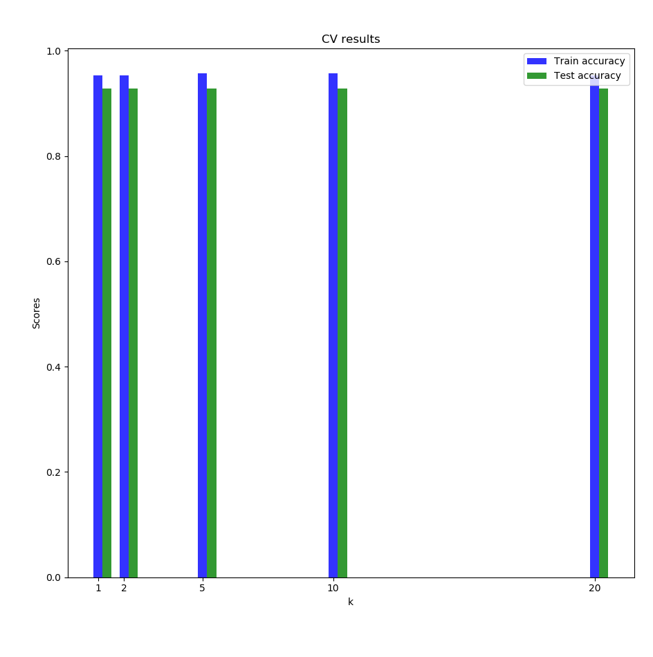

We finally decided to try on a dataset which a higher dimensionality and a higher number of classes: the <a></a>[leaf dataset](https://www.kaggle.com/c/leaf-classification/data) (it contains images, but we used the `train.csv` file which has \\(n=990\\), \\(d=192\\) and \\(99\\) different classes). The CV results stayed quite high without very long runtimes:  
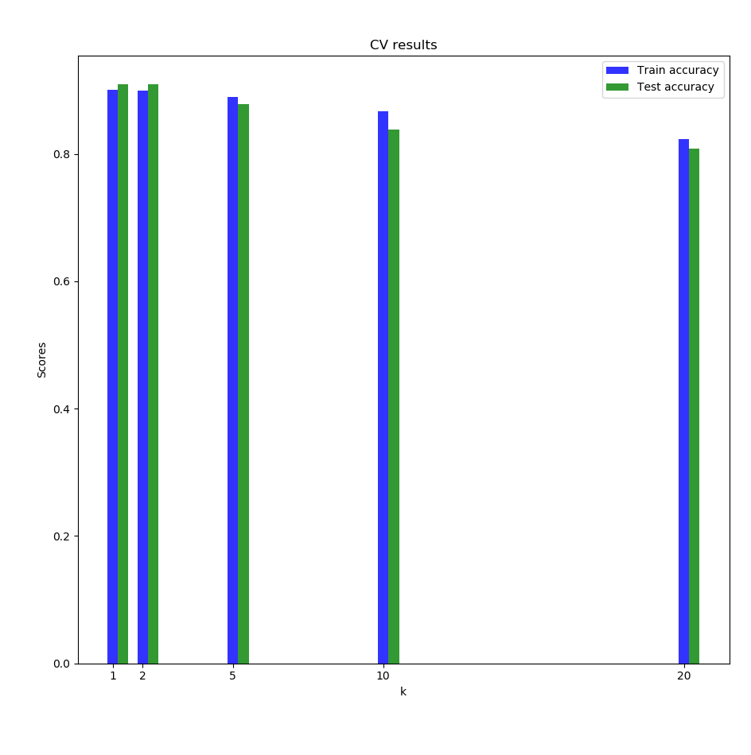

# 4 Future works to be done

## 4.1 Change sort for tree creation

One of the biggest factors of computing time is the creation of the tree. Indeed unless we have a very large set of points to classify (ie. \\(p \gg n\\)), the time complexity of the final program is of the same magnitude as the one for the creation of the tree. Therefore any effort to speed up the creation of the tree. We saw that there were algorithms such as the median of median algorithms that would allow to create the tree in a \\(o(nlog(n))\\) time complexity, which is better than the current complexity we have at the moment by a factor of \\(log(n)\\). This better complexity would then allow us to run th algorithm more quickly.

## 4.2 Use approximate KNN for selecting hyper-parameters

There are other improvements that could be made to lower the overall required computing time. One of the ides that we had is to use approximate nearest neighbor search instead of exact nearest neighbor search during the cross validation process to select the best value of \\(k\\) and then use that best value in our \\(k\\)-d tree implementation to classify the unlabeled points. One of these approximate nearest neighbor methods we found very interesting is Locality Sensitive Hashing (LSH), that uses locality sensitive hash function, meaning hash functions that produce collisions for points that are close to on another. So the points that are close to one another end up in the same bucket when hashed. And therefore we can have a rough idea of the \\(k\\) nearest neighbors. his method can be very fast because there are no point to point comparisons required. The runtime is dependent of the hash function runtime. We could use this fast method to see which value of \\(k\\) yields the best results during the cross-validation at a much lower runtime than with the naive approach or even the \\(k\\)-d tree approach.

## 4.3 Be able to use categorical data

In various classification tasks, points are not necessarily in euclidean space, in some cases the points can have categorical variables. Even though it is not conventional to use \\(k\\)-NN with categorical data it could be interesting to be able to encode categorical values in numerical values and integrate them in the distance calculation. Or ignore the categorical values and calculate the distance with only the numerical values. In any case it would be good for this program to at least run without errors when presented with categorical data.  

The code is available on <a></a>[this repository](https://github.com/zlanderous/kd-trees-KNN).
