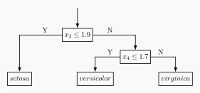
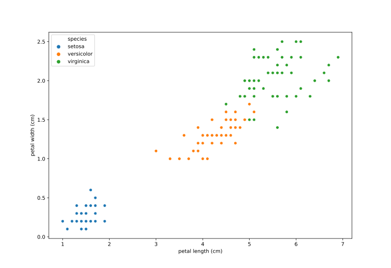
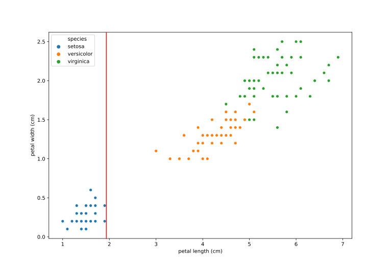
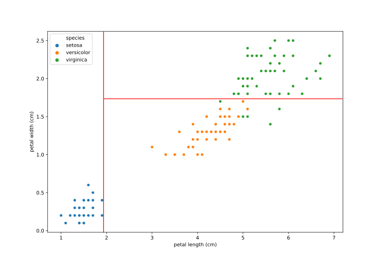
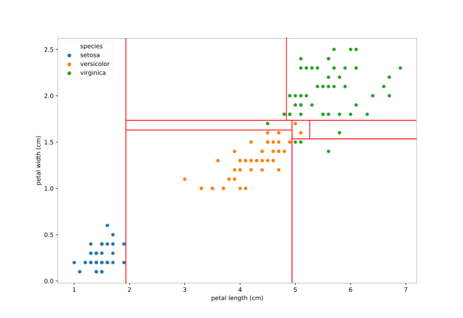
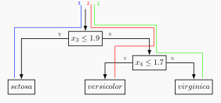

The first subject I want to tackle on this page is decision trees. What are they? How do they work? How can I make one?  
I am planning to make a small series, ranging from explaining the concept, to implementing a decision tree inference algorithm and hopefully all the way up to implementing Random Forests.  
All right let's get started.

<!--more-->

# Example data {#simple-tree}

We are going to use, as an example, the Fisher Iris dataset (more info [here][1]) and we are going to build a tree that can separate the different types of irises (classes), which is called a classification tree.

This dataset is a simple, standard dataset in machine learning and it is easy to understand.
There are 150 samples _(ie. different flowers)_ of irises, and each of these has 4 features and one label. The features are [petal][2] length and width, as well as [sepal][3] length and width, all in centimeters. The label of each observation is simply
the species of the observed iris, which can be _iris Setosa_, _iris Virginica_ or _iris Versicolor_. The goal of our tree is to help us determine what the characteristics of these different species are, and how we can differentiate them.
So let's look at a small subset of our data:

| sepal length (x1) | sepal width (x2) | petal length (x3) | petal width (x4) |   species    |
| :---------------: | :--------------: | :---------------: | :--------------: | :----------: |
|        6.7        |       3.0        |        5.2        |       2.3        | _Virginica_  |
|        5.0        |       3.2        |        1.2        |       0.2        |   _Setosa_   |
|        5.5        |       2.5        |        4.0        |       1.3        | _Versicolor_ |
|        6.0        |       3.0        |        4.8        |       1.8        | _Virginica_  |
|        4.6        |       3.1        |        1.5        |       0.2        |   _Setosa_   |

A tree built _(more commonly we say trained instead of built)_ on this subset (which we call the **training** or **learning** set), can look something like this:  
<a id='simple-tree'> <a/>

Where the data is split in 2 at each node according to a condition on a feature, for example: _is the petal length lower or equal to 1.7cm?_.  
_(NB. we restrict ourselves to binary decision trees, meaning a node only splits into 2 subnodes, there are decision trees that are non-binary but they are not commonly used)_  
This notion of splitting the data leads us quite well into our next section of seeing trees as partitions.

# Trees are partitions

This is a quite fundamental concept of decision trees. We can imagine our dataset as a multidimensional space, and each internal node of the tree _(ie. a node with a condition not a terminal, leaf node)_ is a partition that splits the space into two subspaces.  
Here our dataset is 4 dimensional, however it is a little complicated for use humans to visually understand 4 dimensions, so let's imagine our dataset with only two dimensions. We will restrict our dataset to only petal length and width _(the 2 features which were used in the simple decision tree above)_. Since it is only 2 dimensions we can easily represent it as a plane:

Now let's represent the splits in our decision trees as lines that separate the plane into 2 sub-planes:  
For the first split, we can draw a vertical line that shows \\(petal\ length = 1.9\\) that corresponds to the first split of our tree. As we can see in the figure below that perfectly separates _iris Setosa_ form the other two:

Now we can draw our second split, the horizontal line representing \\(petal\ width = 1.7\\). This split only divides the _right_ subspace of our first split, this is called [recursive partitioning][4]. As you can see below, this separates our two remaining species, _Versicolor_ and _Virginica_ fairly well. However, near the boundary of this second split, we can see some of our _Versicolor_ flowers end un on the _Virginica_ side and _vice-versa_.

_Why don't we keep partitioning until there are no stragglers ?_ you might ask.  
To understand that let's take a look at what the tree would look like if we kept splitting the dataset until each subspace was only filled with one species:

As you can see this tree is a lot bigger and more complicated to take in, and it has splits that are very close to one another like \\(petal\ length = 4.9\\) and \\(petal\ length = 4.8\\)

_(N.b, you might have noticed in middle-top partition there appears to be only a sample of Virginica, so why was is separated from the middle-right partition which is also Virginica? In reality, because of the low precision of the dataset measurements, there are 2 Versicolor and 1 Virginica that have the same values for petal length and width, making them indistinguishable in the plane)_

The decision tree we have here is very specific to our present dataset, it splits as much as possible to **fit** our **training data**, and what it is doing is called **overfitting**. This means that our tree is so specific to the data it was given, that if we get new samples _(ie. petal lengths and widths for new flowers not in the dataset)_, and we cycle them through the tree they might not end up detected as the right species. This is one of the reasons we want to restrict our decision tree to generalize it.

There are a couple ways to restrict the tree, either by specifying a maximum depth value _(how many splits in a row you can do)_, or a threshold value _(if a split has a species that makes up more than 90% of it's samples we can call it "pure" and stop splitting for examples)_ or by **pruning** the tree, meaning we make a decision tree that is av precise as possible, very overfitted, and then, according to a set of rules, we remove the branches and nodes that are too specific.

# How do we know if our tree is any good ?

To be able to answer that question we need to know how we use a decision tree to make, well... decisions. First we need some examples that are not in the **training** set, so examples that have not been used to build the decision tree. And then we see how this example travels through the tree and in which leaf it ends up. Let's take our [simple tree](#simple-tree) again, as well as the following data points:

| sample id | sepal length (x1) | sepal width (x2) | petal length (x3) | petal width (x4) | species      |
| :-------: | :---------------: | :--------------: | :---------------: | :--------------: | ------------ |
|     1     |        7.7        |       2.8        |        6.7        |       2.0        | _Virginica_  |
|     2     |        6.1        |       3.0        |        4.6        |       1.4        | _Versicolor_ |
|     3     |        4.7        |       3.2        |        1.6        |       0.2        | _Setosa_     |
|     4     |        7.2        |       3.0        |        5.8        |       1.6        | _Virginica_  |

I've represented the decision paths (how the sample goes through the tree) of the first 3 samples with colors.

So for sample 2 _(the Versicolor)_ the petal length is \\(> 1.9\\) so it goes right at the first node, the petal width is \\(\leq 1.7\\) so it goes left at the second node and is correctly classified as Vversicolor_. The same goes for samples 1 and 3. Let's take our fourth sample now, its petal length is \\(5.8\\) which is \\(>1.9\\) so it goes right at the first split, until now everything is OK, however its petal width is \\(1.6\\) which is \\(\leq 1.7\\), so it will go left at the second split and be detected as _Versicolor_ even though it is a _Virginica_, so our tree made a mistake.  

We can use these mistakes if our tree is representative of our data or not. To do this we separate a part of our dataset, before training our tree, into a **training** and a **testing** set (a classical split is to keep 20% of our data as testing data), after which we train our tree on the **training** set. To evaluate our model, we take all of the samples and run each of them through the tree and save the output _(ie. the predicted class)_. From this we can calculate the misclassification rate which is just the number of mistakes our tree makes divided by the total number of samples in the **testing** set.  

Our tree making some small mistakes is inevitable (cases on a boundary between 2 classes can be a little tricky), and actually a good sign of a well-generalized model. Indeed if you see misclassification rates \\(\approx 0\\) it is a strong sign that your tree might be overfitting and that the testing data is very similar to the training data.

## A note on regression

So far we have only seen how our tree can be used to classify data, meaning the leaves of our tree are classes. Each of our leaves have a subset of the training data (all the examples for which the decision paths end up at that leaf), and the leaf class corresponds to the majority class of the examples in its subset.  
For regression we don't want to predict discrete classes, but a continuous value _(for example the price of an apartment)_, and to do this we build the tree in the exact same way, by grouping similar values based on splits. A predicted value is then assigned to each leaf node, nd it is equal to the mean of all the target values of the examples in the leaf data subset.  
We can still evaluate the "goodness" of our tree, not by using the misclassification rate, but by using [RMSE][5] (Root Mean Square Error) for example.

## conclusion

OK so that was a quick introduction to decision trees, and my goal was to make you understand how a decision tree works, that it is just a set of nested partitions. Here we restricted ourselves to 2-D but it is easy to see how this carries to 3-D, we have a volume instead of a plane, and splits are surfaces instead of lines.  
Stay tuned for [part 2][6] where I will go over the CART algorithm for building these decision trees.

[1]: https://en.wikipedia.org/wiki/Iris_flower_data_set
[2]: https://en.wikipedia.org/wiki/Petal
[3]: https://en.wikipedia.org/wiki/Sepal
[4]: https://en.wikipedia.org/wiki/Recursive_partitioning
[5]: https://en.wikipedia.org/wiki/Root-mean-square_deviation
[6]: 
